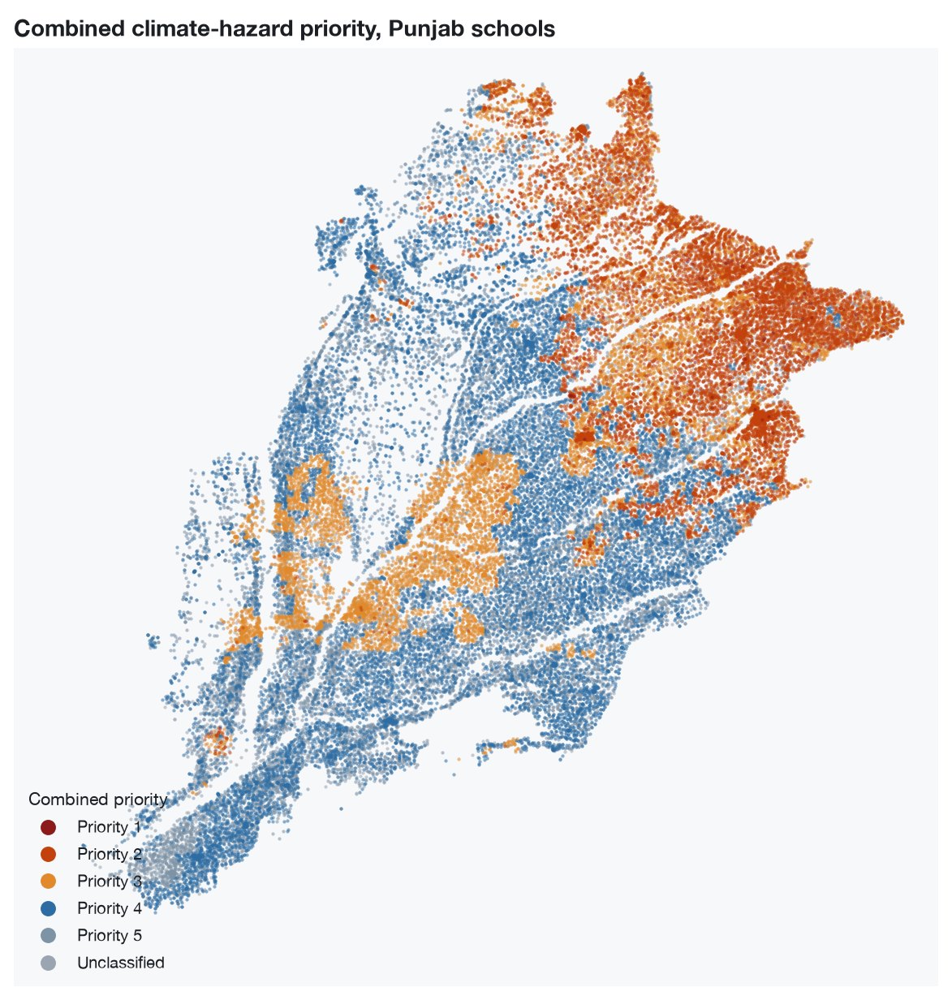
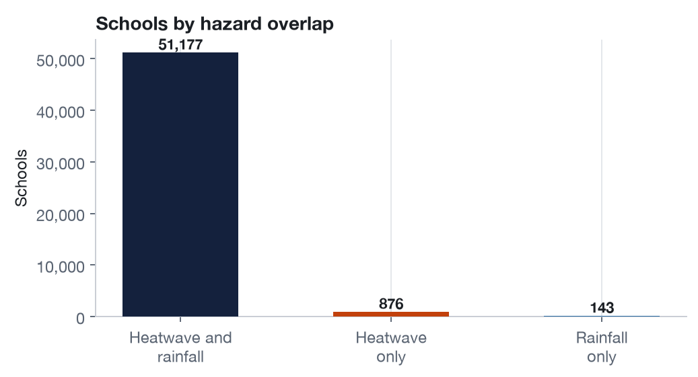
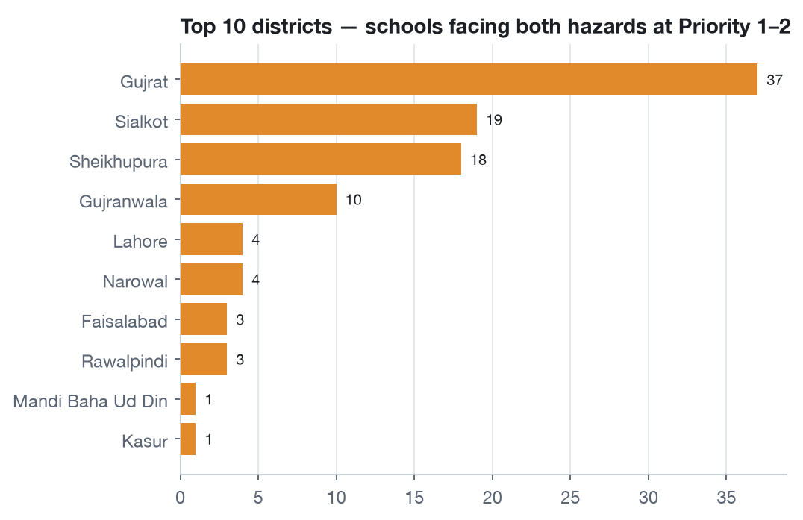
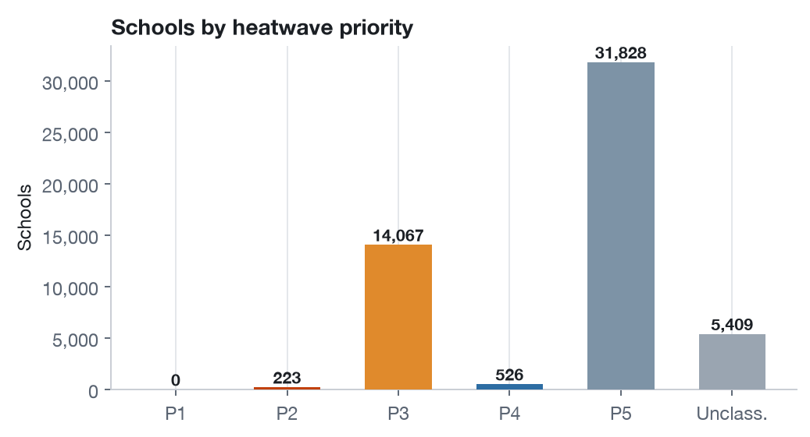
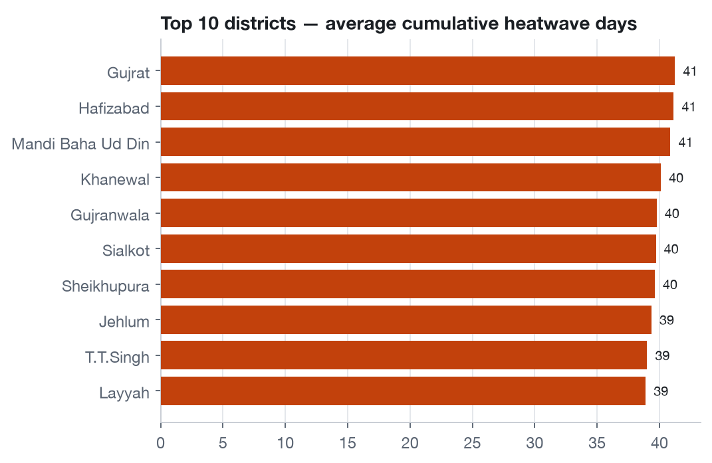
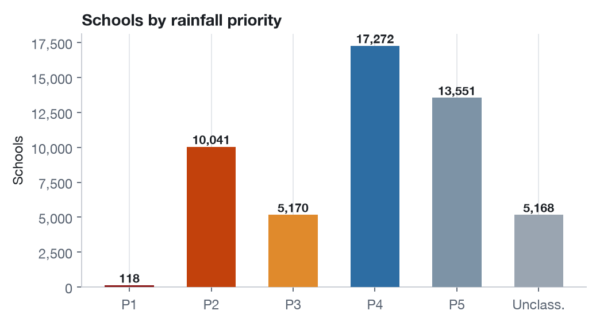
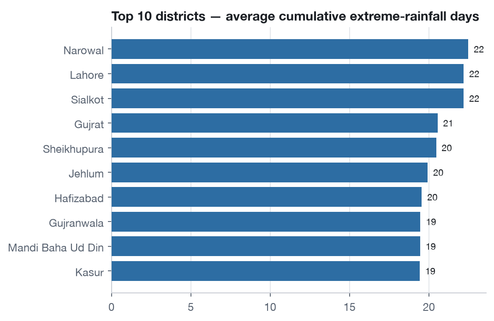
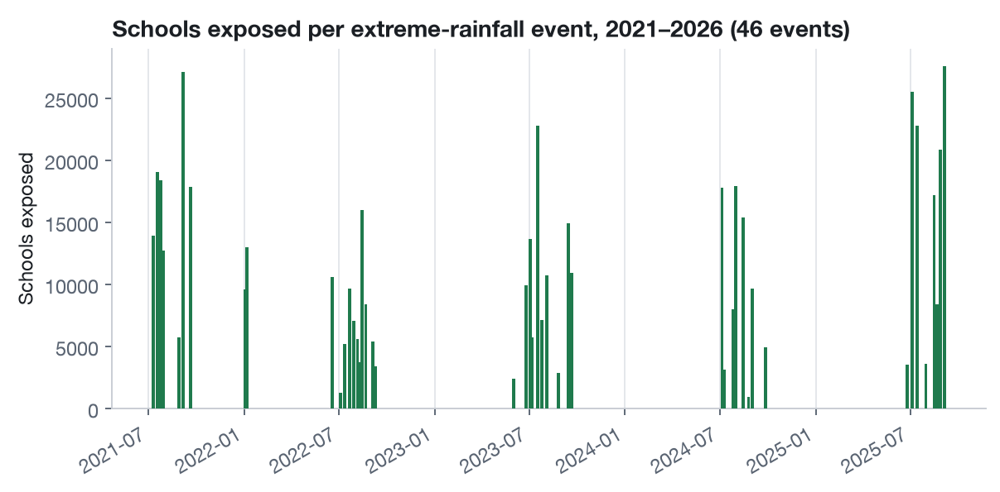

# Understanding Climate-Related Educational Disruptions in Pakistan Through the Lens of Data, Inequality, and Policy

**Funder:** DARE-RC (Data and Research in Education Research Consortium), funded with UK International Development from the UK Government
**Lead unit:** Syed Babar Ali School of Science and Engineering (SBASSE), LUMS — in close collaboration with the Syed Ahsan Ali and Syed Maratib Ali School of Education (SOE) and the **Centre for Urban Informatics, Technology, and Policy (CITY)**, LUMS
**Duration:** April 2026 – September 2026
**Principal Investigator:** Dr. Zubair Khalid (Associate Professor, SBASSE; Co-Director, CITY)
**Co-Investigators:** Dr. Jessica Albrent (SOE), Dr. Mohammad Mansoor Khan (SOE)
**Research team:** Aymen Asif, Asfra Rizwan, Hajra Javed, Mina Arif, Mahnoor Naveed, Nausherwan Malik

---

## Overview

Climate change is one of the most significant emerging threats to educational access, continuity, and equity in Pakistan. The 2022 floods alone disrupted schooling for an estimated 3.5 million children and pushed 1 million out of school entirely — with the impact falling hardest on lower-income households. Despite this, there is very little evidence on how extreme climate events interact with socioeconomic inequality to disrupt educational access and learning, and even less on how existing data systems could be used to track and respond to that disruption.

This project addresses that gap. It combines a systematic scoping review, key informant interviews with policymakers and data custodians, and a secondary analysis of climate, education, and socioeconomic datasets to map what is known, identify data gaps, and examine how climate shocks affect schooling differently across socioeconomic groups in Pakistan. The findings are intended to inform evidence-based policymaking at the federal and provincial level, and to strengthen the integration of climate and education data systems.

At LUMS, the project is led by SBASSE and draws on CITY's expertise in geospatial data, climate modelling, and urban informatics to build the climate-exposure analysis, paired with SOE's expertise in education policy and practice for the qualitative and policy-facing components.

## Research questions

1. **Where and when** are schools in Punjab and Sindh exposed to extreme heat, extreme rainfall, and dry spells — and how many students, by school level and gender, are affected?
2. **Do extreme climate events cause measurable enrolment disruption** in Punjab government schools — how large, how persistent, and which school types are most affected?
3. **Which districts and school categories face compounding climate exposure and educational vulnerability**, and should be prioritised for climate-resilience investment?

## Approach

The project is structured in three phases, with stakeholder interviews iterating across all of them:

- **Systematic scoping review** — mapping academic, grey, and policy literature on climate-related educational disruption, following Arksey & O'Malley and PRISMA-ScR screening principles.
- **Key informant interviews** — semi-structured interviews with policymakers, researchers, development partners, and data custodians across Punjab, Sindh, Khyber Pakhtunkhwa, and Balochistan, using snowball sampling to surface data gaps and validate emerging findings.
- **Secondary data analysis** — triangulating satellite-derived climate indices (ERA5, CHIRPS, Sentinel-1 SAR) with administrative education datasets (EMIS/SIS) for Punjab and Sindh, to detect climate-extreme episodes and map them against school exposure and enrolment.

The analysis is organised around three workstreams:

| Workstream | Focus |
| --- | --- |
| **1. Climate Extremes & School Exposure Atlas** | Percentile-based detection of heatwave, extreme-rainfall, and dry-spell episodes on 1 km daily climate grids, overlaid on geo-located schools in Punjab and Sindh to estimate exposed schools and students, disaggregated by school level and gender. |
| **2. Enrolment Disruption Analysis (Punjab)** | An event-study design on a five-year monthly enrolment panel, comparing exposed and matched unexposed schools around each climate episode, to estimate the size and persistence of enrolment disruption by hazard type. |

## Dashboard snapshot: Punjab School Climate-Exposure Atlas

As part of Workstream 1, the project team built an internal dashboard covering every government school in Punjab exposed to heatwave or extreme-rainfall hazards since 2021 — which schools face the greatest risk, where the two hazards compound, and what coping capacity (electricity, water, sanitation, learning space) looks like on the ground.

The dashboard itself holds school-level administrative data and is not public. What follows is a **static snapshot**: the same summary statistics and charts the dashboard produces, computed once from the underlying data and published here as fixed figures — no per-school records, no live filtering, and no data file leaves the research team. *Snapshot generated August 2026 from the project's cumulative and event-level datasets (2021–2026).*

> **Note:** this Markdown version shows the numbers as static tables/images. The companion `city-lums-project-page.html` in this folder is the canonical version — it replicates the live dashboard's tabs, clickable map legend, and district/school-level filters in JavaScript, recomputing from the same pre-aggregated counts (never per-school rows). Use the HTML file when publishing; this file is a plain-text fallback.

### 🌍 Where the risk is

A combined view of every exposed school, taking the more severe of its heatwave and rainfall priority.

| Schools tracked | Students in exposed schools | Urgent (Priority 1–2) | Compounding (both hazards, P1–2) | Districts covered |
| --- | --- | --- | --- | --- |
| 52,196 | 18.7M | 10,279 | 103 | 36 |

*Every tracked school, coloured by combined priority. Darker orange/red clusters mark the north and northeast of the province.*

*98% of tracked schools have recorded exposure to both hazards since 2021; 876 are heatwave-only and 143 rainfall-only.*

| Combined priority | Schools |
| --- | --- |
| Priority 1 (most urgent) | 118 |
| Priority 2 | 10,161 |
| Priority 3 | 11,096 |
| Priority 4 | 14,356 |
| Priority 5 (least urgent) | 11,937 |
| Unclassified — capacity data missing | 4,528 |

*Gujrat, Sialkot, Sheikhupura, and Gujranwala account for 84 of the 103 schools independently at Priority 1–2 on both hazards.*

### 🌡️ Heat

Cumulative heatwave exposure per school since 2021, classified against coping capacity from the nearest government (PMIU) visit.

| Schools exposed | High exposure | Priority 1–2 |
| --- | --- | --- |
| 52,053 | 15,847 | 223 |

| Exposure class | Cumulative heatwave days | Rule |
| --- | --- | --- |
| Low | 14–34 | At or below the 33rd percentile |
| Moderate | 34–38 | Between the 33rd and 67th percentiles |
| High | 38–48 | Above the 67th percentile |

Electricity data coverage: **89.6%** · Drinking-water data coverage: **90.1%**

*Gujrat, Hafizabad, and Mandi Baha Ud Din have the highest average cumulative heatwave-day exposure.*

### 🌧️ Extreme rainfall

Cumulative exposure across the 46 extreme-rainfall events recorded since 2021, classified against four coping-capacity dimensions (no ASC/SIS capacity extract exists, so all four are PMIU-visit proxies).

| Schools exposed | High exposure | Priority 1–2 | Recorded events |
| --- | --- | --- | --- |
| 51,320 | 16,924 | 10,159 | 46 |

| Exposure class | Cumulative extreme-rainfall days | Rule |
| --- | --- | --- |
| Low | 1–6 | At or below the 33rd percentile |
| Moderate | 6–17 | Between the 33rd and 67th percentiles |
| High | 17–31 | Above the 67th percentile |

Structural condition: **90.2%** · Learning-space continuity: **90.0%** · Sanitation: **91.5%** · Safe water: **90.2%**

*Narowal, Lahore, and Sialkot have the highest average cumulative extreme-rainfall-day exposure.*

*2025 alone accounted for 4 of the 5 largest events by schools exposed.*

| Event | Date | Schools exposed | Students exposed | Max 3-day rainfall |
| --- | --- | --- | --- | --- |
| 2025_R08 | 05 Sep 2025 | 27,610 | 6.51M | 260.0 mm |
| 2021_R06 | 06 Sep 2021 | 27,081 | 6.73M | 461.5 mm |
| 2025_R02 | 05 Jul 2025 | 25,537 | 6.55M | 206.6 mm |
| 2025_R03 | 14 Jul 2025 | 22,802 | 5.92M | 175.1 mm |
| 2023_R05 | 18 Jul 2023 | 22,790 | 5.48M | 368.4 mm |

*The five largest of 46 recorded events, ranked by schools exposed.*

### ℹ️ How this works

Every priority category combines how often a school faces extreme weather with how well-equipped it is to cope, based on its most recent relevant government visit.

| Priority | Meaning |
| --- | --- |
| 🔴 Priority 1 — Urgent | Frequent extreme weather, weak coping capacity. |
| 🟠 Priority 2 — High concern | Frequent extreme weather, real capacity gaps. |
| 🟡 Priority 3 — Exposed, but coping | Frequent extreme weather, comparatively well-equipped. |
| 🔵 Priority 4 — Watch | Less frequent extreme weather, some capacity gaps. |
| ⚪ Priority 5 — Lower concern | Less frequent extreme weather, well-equipped. |
| ⚫ Unclassified — Not enough data | No recent visit recorded the school's condition; a data gap, not a sign of safety. |

*The live dashboard's Find a school lookup and year-by-year detail panels require querying individual school records and are not reproducible as a static snapshot — they remain available to approved users of the internal dashboard.*

## Expected outputs

- A **climate extremes and school exposure atlas** for Punjab and Sindh, with ranked district and school lists.
- A **comprehensive research report** integrating the scoping review, interview findings, and secondary data analysis.
- A **policy brief** with actionable recommendations for climate-resilient education planning in Pakistan.
- A **stakeholder policy roundtable**, convened at LUMS, bringing together government, development partners, and academia to validate findings and discuss policy implications.

## Get in touch

For more on this project, contact the research team at the LUMS Syed Ahsan Ali and Syed Maratib Ali School of Education, or follow DARE-RC's broader research portfolio at [www.darerc.org](https://www.darerc.org).
